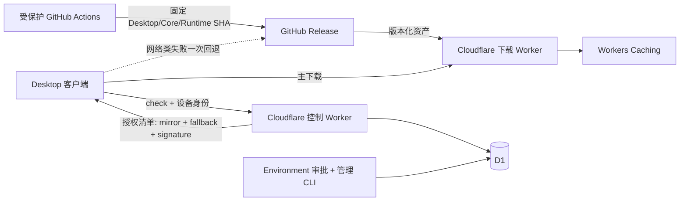

# 02. 目标架构与版本兼容矩阵

## 1. 架构与信任边界



关键原则：

- GitHub Release 是唯一持久化字节来源。
- D1 是“能不能下发”的事实源，不保存安装包。
- 下载 Worker 只能代理 `Eynzof/Hermes-CN-Desktop` 的固定 tag、单层安全文件名，不能成为开放代理。
- Bearer token 只进入控制 Worker；镜像和 GitHub 请求没有 Authorization。
- 两个下载来源都使用控制面返回的同一份 Tauri detached signature、SHA-256 和大小。

## 2. 控制接口

```text
GET  /health
GET  /v1/check/{channel}/{target}/{arch}/{current_version}
POST /v1/events
```

`prototype/canary/beta`：Bearer token 查 D1，token 对应 device 的 ring 必须与路径 channel 一致。

`stable`：不使用身份 token；本机随机 installation ID 作为确定性灰度输入。它不是账号，也不能用于跨设备追踪。

所有检查、204 和错误响应均为 `Cache-Control: no-store`。控制 Worker 不提供安装包路由。

## 3. 清单契约

控制 Worker 返回 Tauri updater JSON，并要求 metadata schema 2：

```json
{
  "version": "0.8.1",
  "url": "https://hot-update-download-staging.hermesagent.org.cn/v0.8.1/Hermes_0.8.1_x64.nsis.zip",
  "signature": "<tauri-signature>",
  "metadata": {
    "schemaVersion": 2,
    "releaseId": "desktop-0.8.1-windows-x86_64",
    "channel": "canary",
    "githubReleaseTag": "v0.8.1",
    "githubFallbackUrl": "https://github.com/Eynzof/Hermes-CN-Desktop/releases/download/v0.8.1/Hermes_0.8.1_x64.nsis.zip",
    "sha256": "<sha256>",
    "size": 185000000,
    "bundledCoreVersion": "0.20.0",
    "bundledRuntimeVersion": "0.20.0-cn.9",
    "runtimeRevision": 9
  }
}
```

客户端拒绝缺字段、channel 不同、tag/version 不同、release ID 不符合目标平台、非固定 GitHub 仓库、超过 480 MiB 或版本不兼容的清单。

## 4. Desktop↔Core 唯一兼容矩阵

事实源：`compatibility/desktop-core.json`。

| Desktop 系列 | Core 系列 | Runtime manifest schema | 状态 |
|---|---|---:|---|
| 0.8.x | 0.20.x | 2 | current |
| 0.7.x | 0.19.x | 2 | historical |
| 0.6.x | 0.18.x | 2 | historical |
| 0.5.x | 0.17.x | 2 | historical |

每次 Core 版本变化必须同时处理：

1. `compatibility/desktop-core.json`。
2. `web/src/lib/build-info.ts` 的 `EXPECTED_BACKEND_VERSION`。
3. 固定 Runtime tag 与 manifest `sourceCommit/kernelVersion/runtimeVersion/runtimeRevision`。
4. release record 和客户端 metadata。

CI、Rust 客户端和前端展示读取同一矩阵，禁止在 D1 或工作流里另写一份“猜测兼容关系”。

## 5. Runtime 防降级与双层更新

Desktop 安装包内置 Core/Runtime，但本机可能已经有更高 Runtime revision。安装前后的规则是：

- 版本兼容是必要条件，不代表允许降级。
- managed Runtime 保留 current/previous 指针；更低 revision 不覆盖更高 revision。
- Desktop 壳更新和 Runtime/UI 更新是独立状态机。
- stable 本期只开放完整 Desktop/Tauri 更新；独立 UI 热更新继续留在内测/dev，不随 stable 开放。

升级承重标识永久保持 `cn.org.hermesagent.desktop`。改变 identifier 会把升级变成另一个应用，属于禁止项。
