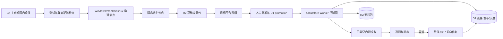

# 02. 目标架构与版本兼容矩阵

## 1. 总体架构



关键顺序固定为：**构建 → 验证版本 → 签名 → 上传并回读校验 → 草稿冒烟 → 人工发布**。绝不允许先把可见清单发布出去，再慢慢上传文件。

## 2. 三条生产更新轨道

### 2.1 Desktop 壳轨道

- 载荷：Tauri 完整安装包。
- 适用：Rust/Tauri、IPC、CSP、内嵌 Web、打包资源或安装行为变化。
- 客户端：`tauri-plugin-updater`。
- 验证：目标 Desktop 版本、更新签名、响应中的 Core/Runtime 元数据、兼容矩阵。
- 回退策略：不自动降级，采用暂停 + 前向修复。

### 2.2 Managed Runtime 轨道

- 载荷：Hermes-CN-Core PyInstaller Runtime。
- 适用：Core 修复且 Desktop 接口仍兼容。
- 验证：Runtime manifest 签名、SHA-256、平台/架构、manifest schema、Desktop↔Core 兼容矩阵和 runtime revision。
- 激活：下载到 staging 目录、解压/冒烟、原子切换并重启 Core。
- 回退：保留上一版 Runtime，可本地回切；启动时不会用内嵌旧 Runtime 覆盖磁盘上更新且兼容的版本。

### 2.3 UI 轨道

- 载荷：签名的 `web/dist`。
- 适用：不新增或改变 Tauri IPC、CSP、Rust 能力的纯前端修复。
- 验证：UI manifest 签名、SHA-256、`appVersionFloor`、平台/架构和文件冒烟。
- 回退：切回上一版 UI；失败时回落到安装包内嵌 UI。

三条轨道必须独立编号和审计。Desktop 安装包可以携带某个 Runtime，但这不表示两者 SemVer 必须相同。

## 3. 兼容矩阵是唯一事实源

文件：[`../../compatibility/desktop-core.json`](../../compatibility/desktop-core.json)

当前矩阵：

| Desktop 系列 | Core/Runtime 系列 | Runtime manifest schema | 状态 |
|---|---|---:|---|
| `0.8.x` | `0.20.x` | 2 | current |
| `0.7.x` | `0.19.x` | 2 | historical |
| `0.6.x` | `0.18.x` | 2 | historical |
| `0.5.x` | `0.17.x` | 2 | historical |

`0.8.1-hotupdate.1` 仍属于 Desktop `0.8` 系列；`0.20.0-cn.9` 仍属于 Core/Runtime `0.20` 系列。预发布和 build metadata 不改变系列判断。

## 4. 矩阵在哪里生效

| 时机 | 检查 | 失败行为 |
|---|---|---|
| 本地/CI `pnpm typecheck` | 矩阵格式、当前 Desktop 系列是否有规则 | 直接失败 |
| `compatibility:check --core <path>` | Core 源码 `pyproject.toml` 是否在允许系列 | 直接失败 |
| `compatibility:check --runtime-manifest <file>` | Runtime 内核版本、包版本和 schema | 直接失败 |
| Desktop 检查壳更新 | 候选响应声明的 `bundledCoreVersion` 与 `bundledRuntimeVersion` | UI 标记不兼容，不允许安装 |
| Runtime 安装/启动 | Runtime manifest 和磁盘当前版本 | 拒绝激活；保留可用版本 |
| 连接外部 Core | `/api/version` 返回的 Core 系列 | 不兼容时提示并退出/拒绝连接 |

仅在 UI 上显示“预计兼容”不够；同一个 JSON 已嵌入 Rust，并由前端与脚本共同消费。

## 5. 壳更新响应契约

Worker 返回 Tauri updater JSON，并增加项目自己的兼容元数据：

```jsonc
{
  "version": "0.8.1-hotupdate.1",
  "pub_date": "2026-08-22T00:00:00Z",
  "url": "https://hot-update-staging.hermesagent.org.cn/v1/artifacts/<release>/<file>",
  "signature": "<Tauri updater signature>",
  "notes": "内测说明",
  "metadata": {
    "releaseId": "prototype-win-0.8.1-hotupdate.1",
    "channel": "prototype",
    "bundledCoreVersion": "0.20.0",
    "bundledRuntimeVersion": "0.20.0-cn.9",
    "runtimeRevision": 9
  }
}
```

客户端必须同时满足：

1. `version` 严格高于当前 Desktop 版本；
2. `metadata` 必填字段齐全；
3. Desktop 候选与 Core/Runtime 候选命中兼容矩阵；
4. 下载文件通过 Tauri updater 公钥验签；
5. 平台、架构和安装包类型匹配。

任何一个条件不满足都不启动安装器。

## 6. 版本演进规则

1. Desktop、Core、Runtime、UI 各自维护版本，不再使用 `sameVersion`。
2. 每次新 Desktop `major.minor` 开发前，先在矩阵中增加规则，再写代码。
3. 一个 Desktop 系列可以短期兼容两个相邻 Core 系列，但必须有真实双向测试，不因“可能兼容”而扩张范围。
4. 删除旧规则前，确认该 Desktop 系列已退出支持周期；历史规则默认保留，便于读取旧发布记录。
5. Runtime manifest schema 升级采用“双读先行”：先发布能同时读取旧/新 schema 的 Desktop，再发布只使用新 schema 的 Runtime。
6. 发布记录保存精确版本、Runtime revision、源提交和 SHA-256；兼容矩阵只表达允许的系列，不能替代精确物料清单。

## 7. 当前代码与后续边界

- **已实现**：兼容矩阵、壳更新候选校验、Runtime 启动/安装校验、内嵌 Runtime 降级保护。
- **已实测**：Desktop `0.8.1-hotupdate.0 → .1`，Core `0.20.0`、Runtime `0.20.0-cn.9` 保持正确。
- **规划**：将构建物料清单（SBOM/源 SHA/依赖锁文件摘要）作为发布记录的一部分；将矩阵变更纳入强制代码评审。
