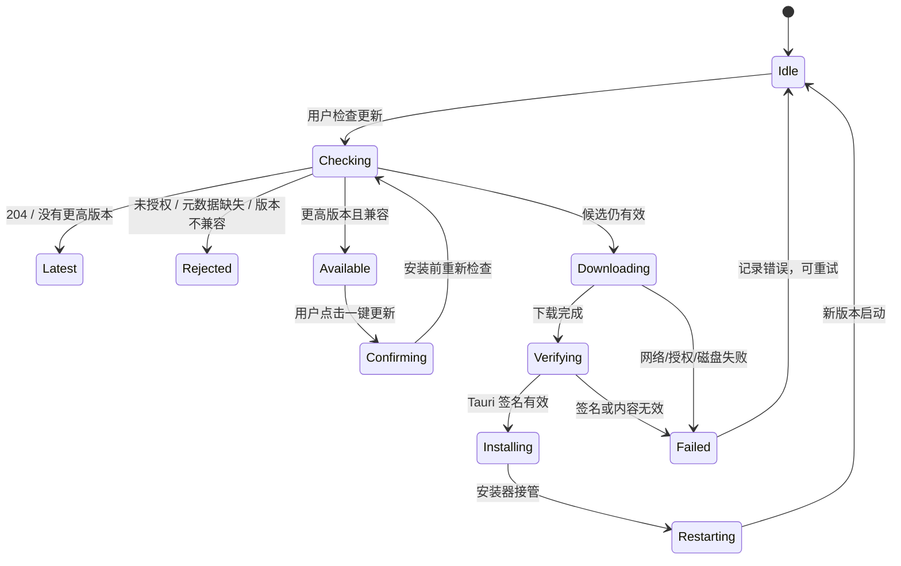

# 05. Tauri 客户端状态机与回滚

## 1. 为什么改用 Tauri 官方 updater

Desktop 壳更新现在使用 `tauri-plugin-updater`，不再由项目脚本自行下载并调用安装器。官方插件负责版本比较、下载、detached signature 校验和平台安装行为，项目代码只增加：动态内测端点、设备鉴权、兼容矩阵、UI 进度和发布元数据检查。

参考：[Tauri Updater 官方文档](https://v2.tauri.app/plugin/updater/)；[Windows 安装包签名说明](https://v2.tauri.app/distribute/sign/windows/)。

## 2. 客户端信任边界

```text
HTTPS 域名证书
  ↓ 保护传输
Bearer device token
  ↓ 决定这台设备是否能看到/下载候选
Tauri updater public key
  ↓ 验证安装包确实由发布方签过
Desktop↔Core compatibility matrix
  ↓ 验证包内版本组合能运行
Windows Authenticode / macOS code signing
  ↓ 操作系统确认发布者与二进制身份
```

四层互不替代。设备 token 泄漏不能伪造签名包；Tauri 私钥安全也不能弥补错误的版本兼容声明；Tauri 签名也不能替代 Windows SmartScreen 需要的 Authenticode 信誉。

## 3. 配置

`tauri.conf.json` 中：

- 内置 staging updater 公钥；
- `endpoints` 为空，避免原型构建自动访问公开 stable；
- `createUpdaterArtifacts: true`；
- Windows `installMode: passive`。

运行时端点优先从 `HERMES_SHELL_UPDATE_ENDPOINT` 读取，也可来自 schema 2 的 `update-config.json.shellUpdaterEndpoint`。端点必须是 HTTPS。

内测模板：

```text
HERMES_SHELL_UPDATE_ENDPOINT=https://hot-update-staging.hermesagent.org.cn/v1/check/{{target}}/{{arch}}/{{current_version}}
HERMES_SHELL_UPDATE_TOKEN=<per-device token>
```

token 只从环境/未来的 OS 凭据存储进入 updater 请求，不写入 `update-config.json`。

## 4. 状态机



安装前重新检查非常重要：用户第一次看到候选后，管理员可能已经暂停它。第二次检查能在下载前收回许可。

## 5. 进度和错误语义

Rust 通过 `app-update-progress` 发送：

| phase | 百分比范围 | 含义 |
|---|---:|---|
| `check` | 1–2 | 初始化 updater、重新获取候选、检查 metadata/兼容矩阵 |
| `download` | 8–90 | 下载字节进度；无 Content-Length 时保持最近值 |
| `verify-signature` | 92 | 下载结束，Tauri 正在验签/准备安装 |
| `install` | 100 | 平台安装器已启动 |

当前实现一次只允许一个壳更新。网络失败、401、无候选、签名错误、安装器错误均回到 UI，不改变当前 Runtime；安装流程开始前不会先替换 Core。

## 6. 暂停、撤销与“回滚”

### 6.1 尚未升级的设备

将 release 改为 `paused` 且比例设为 `0`：

- 检查返回 `204`；
- 对应 artifact 路由返回 `404`；
- 即使用户之前看见过候选，安装前的重新检查也会阻断；
- 已经建立的单个下载响应或已经完整下载并启动的安装器无法远程收回。

### 6.2 已经升级的设备

不自动下发低版本。桌面安装通常会迁移配置和数据，降级后的旧代码未必能读取新结构；攻击者也可能利用降级重新引入已修漏洞。

正确处理：

1. 立即暂停问题 release；
2. 保持新版本的数据格式向后/向前兼容，禁止破坏性迁移；
3. 从最后已知良好提交制作一个**更高 Desktop 版本号**的前向修复；
4. 用相同 canary 顺序重新发布；
5. 只有在应用完全无法启动且有专门灾难恢复包时，才人工执行受控降级，并先备份用户数据。

### 6.3 Runtime/UI

Runtime 与 UI 使用自己的本地版本目录和 previous 指针，可以在 Desktop 不变时回退上一版。壳发布暂停不会自动改动这两条轨道；事故处理必须明确是哪条轨道出问题。

## 7. 失败场景与预期结果

| 场景 | 客户端结果 | 服务端动作 |
|---|---|---|
| token 缺失/错误 | 401，UI 显示检查失败 | 检查设备是否误禁用；不泄露 release 信息 |
| ring 没有候选/比例未命中 | 204，显示已是最新 | 无 |
| Core 元数据与矩阵不符 | 显示不兼容，一键更新禁用 | 修正构建，不允许只改 D1 元数据掩盖错误 |
| 下载中网络中断 | 当前版继续运行，可重试 | 查看 Range/错误率；必要时暂停 |
| 安装包被改动 | Tauri 验签失败，不安装 | 立即暂停，核对 R2 回读 SHA 和签名顺序 |
| 安装后无法启动 | watchdog/人工检测失败 | 暂停，制作前向修复；保留数据和 Runtime 证据 |
| 控制面不可达 | 当前版继续运行 | 不应阻塞应用启动；按网络灾备切换域名/镜像 |

## 8. 生产前还要补的客户端能力

- 将设备 token 迁移到 Credential Manager/Keychain，并支持轮换。
- 上报不含隐私内容的阶段性结果：check/download/verify/install/relaunch，以及 release ID 和匿名设备 ID。
- 新版本首次启动写“升级完成”标记；若连续启动失败，提供人工恢复入口，不自动静默降级。
- 将 staging 和 production 公钥/域名彻底分离；正式包不能信任 staging 私钥。
- 明确代理、系统证书、超时、限速和断点续传在三大平台上的行为。
