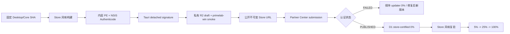

# 11. 微软商店上架与热更新（2026-08-23）

本文回答一个具体问题：Hermes Agent CN Desktop 如果通过 Microsoft Store 上架，现有 Desktop、Runtime、UI 三条更新轨道应该如何处理。

当前状态是**方案调研**，没有创建 Partner Center 产品、没有上传安装包，也没有修改任何线上发布。

## 1. 结论

近期推荐采用 **Microsoft Store 的传统 Win32 EXE 路径**，不是立即改成 MSIX：

1. 为商店单独构建一个 `windows-store-x64` NSIS 安装包。
2. 保留 Tauri 完整壳 updater。微软明确说明：EXE/MSI 商店产品的现有用户可以由应用内安装更新，商店本身不会给这些用户自动或手动推送更新。
3. 每个 Store stable 安装包必须先通过 Partner Center 认证并进入 `PUBLISHED/In the Store`，Cloudflare 的 `store-stable` updater 才能向现有商店用户开放同一份二进制。
4. 首个商店版本默认关闭独立 Runtime 更新和 UI 热更，只允许经过完整构建、签名和商店认证的整包更新。
5. 商店安装包及其全部 PE 文件必须有受 Microsoft Trusted Root Program 信任的 Authenticode 签名；Tauri updater detached signature 继续作为第二层校验。
6. 商店提交 URL 必须是公开、版本化、不可覆盖的 HTTPS 直链，不能复用当前要求 Bearer token 的私有 artifact 路由。
7. 长期如果完成 MSIX 适配，再把壳更新完全交给 Microsoft Store，并在 MSIX 风味中关闭 Tauri 壳 updater。

这一方案保留现有原型投入，同时把商店认证、动态代码和中国大陆网络风险限制在可控范围内。

## 2. 两条商店路径的区别

| 项目 | EXE/NSIS 商店列表（近期推荐） | MSIX 商店包（长期评估） |
|---|---|---|
| Tauri v2 当前官方支持 | 直接生成 EXE/MSI；官方商店指南采用此路径 | 当前 Tauri 官方指南不直接生成 MSIX，需要额外打包工具和适配 |
| 新用户安装 | Store 从我们提供的版本化 HTTPS URL 获取离线安装包 | 包上传给 Store，由 Microsoft 托管 |
| 现有用户更新 | 应用自己的 updater；Store 不推送 | Store 后台更新，可使用 package flight/渐进发布 |
| 安装包托管 | 我们负责，推荐 Cloudflare R2 自定义域名 | Microsoft 免费 CDN |
| 代码签名 | 发布者签 installer 及全部 PE，证书必须链到受信任 CA | Store 认证后免费重签 MSIX |
| 下载优化 | 当前是完整 NSIS 包 | MSIX 支持基于 block map 的差分下载 |
| 中国大陆网络 | 仍依赖我们自己的 CDN/域名 | 壳下载主要走 Microsoft Store 网络，仍需真实测试 |
| 现有 Runtime/UI 架构 | 改造较小 | 包目录只读、Package Identity 和数据路径都需重新验证 |
| 上线风险 | 中等 | 高，属于另一项独立工程 |

Tauri 官方文档当前明确写明只生成 EXE/MSI，并要求商店安装包离线、支持自动更新、代码签名和静默安装：[Tauri Microsoft Store 指南](https://v2.tauri.app/distribute/microsoft-store/)。微软也确认 EXE/MSI 允许应用内更新，但 Store 不负责向现有用户推送：[发布 EXE/MSI 更新](https://learn.microsoft.com/en-us/windows/apps/publish/publish-your-app/msi/publish-update-to-your-app-on-store)。

## 3. 微软政策边界

### 3.1 动态代码

[Microsoft Store Policies 7.19](https://learn.microsoft.com/en-us/windows/apps/publish/store-policies) 的 10.2.2 不笼统禁止动态代码，但禁止借远程代码根本改变产品描述中的功能，或引入违反商店政策的能力。远程脚本如果执行了与已描述功能不一致的行为，是官方明确给出的风险示例。

对本项目的解释：

- 修复同一产品功能的完整 Desktop 安装包更新可走 EXE/MSI 应用内 updater。
- 独立下载并执行新的 Python Runtime、`.pyd`、DLL 或 JavaScript UI，认证风险明显更高。
- Skills/plugins、模型调用、代码执行和远程 Runtime 都必须在商店描述、隐私政策与 certification notes 中如实说明。
- 不应把“热更新”当成绕过商店审查、上线未描述新功能的通道。

所以首个 Store 风味采用保守策略：**Runtime/UI 随完整安装包一起更新，不单独激活远程版本**。

### 3.2 EXE/MSI 安装包

同一政策的 10.2.9 以及[官方包要求](https://learn.microsoft.com/en-us/windows/apps/publish/publish-your-app/msi/app-package-requirements)要求：

- 只能提交 `.exe` 或 `.msi`；
- URL 必须为 HTTPS 直链；
- URL 必须包含版本，提交后对应二进制不得改变；
- 每个新版本使用新的 URL 并创建更新 submission；
- 安装器和其中全部 PE 文件必须具备受信任 CA 的数字签名；
- 必须支持静默安装；
- 必须是完整离线安装器，不能是运行时再下载主体的 web installer/downloader stub；
- 只能面向 PC。

Tauri NSIS 的静默参数是大写 `/S`。当前项目 `webviewInstallMode=downloadBootstrapper` 不满足商店离线要求，Store 风味必须覆盖为 `offlineInstaller`。

### 3.3 认证与可测试性

[EXE/MSI 认证流程](https://learn.microsoft.com/en-us/windows/apps/publish/publish-your-app/msi/app-certification-process)说明认证最长可能需要三个工作日，并会检查：HTTPS URL、恶意软件、静默安装、标准用户安装、开始菜单/卸载项、干净卸载、离线安装和服务可用性。

Hermes 需要额外准备：

- 可用的审核测试账号；
- 不依赖私人内网的测试后端/模型配置；
- 无网络时不崩溃，能给出清楚提示；
- 隐私政策，说明账号、聊天、模型服务、日志和可选遥测；
- certification notes，解释 managed Core、端口 9120、插件/技能、更新机制和为何不会安装无关软件。

## 4. Store 风味的三条更新轨道

| 轨道 | 首个 Store 版本 | 原因 |
|---|---|---|
| Desktop 壳 | **保留** Tauri updater，只下发完整、已认证安装包 | Store 不更新现有 EXE/MSI 用户；官方允许应用内更新 |
| Managed Runtime | **关闭独立在线更新**；随 Desktop 安装包更新 | Runtime 含大量可执行代码，单独下载会扩大 10.2.2/签名/认证风险 |
| UI 热更 | **关闭独立在线更新**；随 Desktop 安装包更新 | UI 包是远程 JavaScript 代码，容易被解释为绕过认证改变功能 |
| 开发热更新 | 仅 dev build | 不属于 Store 产品功能 |

Direct/canary 风味可以继续验证独立 Runtime/UI 轨道；Store 风味只有在 certification notes 明确披露、全部签名和复审路径得到验证后，才逐项开放。

Store 风味还应禁止用户在设置页随意修改 shell/runtime/UI 更新源。分发渠道必须是构建时不可变事实，不是一个普通偏好设置。

## 5. Store 构建风味

建议保留两个 Windows artifact target：

```text
windows-direct-x64
  webviewInstallMode = downloadBootstrapper
  distribution       = direct
  shell channel       = direct-stable / beta / canary
  runtime/UI update   = 按现有策略

windows-store-x64
  webviewInstallMode = offlineInstaller
  distribution       = microsoft-store-exe
  shell channel       = store-stable
  runtime/UI update   = disabled（首版）
```

二者继续使用升级承重标识 `cn.org.hermesagent.desktop`，但 release record、R2 key、SHA、构建物料和 updater channel 必须分开。应用“关于/诊断”页应显示 distribution，避免现场无法判断安装来源。

Store 覆盖配置示意：

```jsonc
{
  "bundle": {
    "windows": {
      "webviewInstallMode": {
        "type": "offlineInstaller"
      }
    }
  }
}
```

Tauri 官方建议使用独立配置进行 bundle：

```bash
pnpm exec tauri build --no-bundle
pnpm exec tauri bundle --config tauri.microsoftstore.conf.json --bundles nsis
```

该命令只是目标设计；当前仓库尚未添加 `tauri.microsoftstore.conf.json`。

## 6. 签名顺序和当前最大缺口

正确顺序：

```text
签 Runtime 内全部 PE
  -> 重新生成并验证 Runtime zip/manifest
  -> 构建 Store NSIS 离线安装包
  -> Authenticode 签最终 installer 并加时间戳
  -> 对最终 installer 生成 Tauri updater detached signature
  -> 计算 SHA-256/size
  -> 此后一个字节都不能修改
```

本工作树当前 `stable-win32-x64` Runtime zip 中有约 **205 个** `.exe/.dll/.pyd` 文件。仅签主 Tauri exe 和外层 NSIS 不够；必须审计每个 PE：

- 已由 Microsoft、Python、Node 或第三方发布者有效签名的文件，验证证书链和时间戳；
- 项目自产或未签名但允许再分发的 PE，由 Hermes 的受信任 CA 证书签名；
- 无法合法签名、来源不明或验证失败的文件不得进入 Store 包；
- Runtime zip 必须在内部 PE 签名完成后再生成 SHA 和 manifest。

微软当前对 EXE/MSI 要求证书链到 Microsoft Trusted Root Program 中的 CA。MSIX 的免费 Store 重签不适用于 EXE/NSIS。微软的[签名选项对比](https://learn.microsoft.com/en-us/windows/apps/package-and-deploy/code-signing-options)给出的传统 OV 证书参考成本约为每年 150–300 美元，实际价格、组织验证和密钥托管以 CA 报价为准。

## 7. Cloudflare 与 Partner Center 的联合流水线



### 7.1 公开 Store artifact URL

Partner Center 只接收安装包直链，不能依赖客户端自定义 Bearer header。建议新增：

```text
https://store-artifacts.hermesagent.org.cn/windows/0.8.1/
  hermes-agent-cn-desktop_0.8.1_x64-setup.exe
```

要求：

- R2 object write-once，同一路径拒绝覆盖；
- 不提供目录列表；
- `Content-Type`、`Content-Length`、Range、HEAD 正确；
- URL 长期有效，至少覆盖商店 submission 和支持期；
- 上传后从公网完整回读 SHA；
- 公开下载本身不是安全边界，真正信任来自 Authenticode + Tauri signature。

当前 `/v1/artifacts/...` 的设备 Bearer 鉴权仍用于 prototype/canary，不直接给 Partner Center 使用。

### 7.2 发布状态

建议在 D1 release 增加：

```text
distribution                  microsoft-store-exe
store_product_id              Partner Center product ID
store_submission_id           submission ID
store_package_url             版本化公开 URL
store_certification_status    DRAFT | INPROGRESS | PUBLISHED | FAILED
store_certified_at
store_artifact_sha256
```

状态机：

```text
draft
  -> signed
  -> store-submitted
  -> store-certified
  -> published 0%
  -> 5% -> 25% -> 100%
```

`distribution=microsoft-store-exe` 的 release 如果不是 `PUBLISHED` 或 SHA/URL 不一致，控制面必须拒绝 promotion。

[Microsoft Store submission API](https://learn.microsoft.com/en-us/windows/apps/publish/store-submission-api)可以在首次人工创建产品/submission 后自动提交 EXE/MSI 更新，并轮询 `INPROGRESS/PUBLISHED/FAILED`。API 使用 Entra ID service principal；凭据应属于独立 Store submission 身份，不能同时拥有 Cloudflare promotion 权限。

## 8. Store 用户如何检查更新

公开 Store stable 不适合人工给每位用户发 token。建议新增只读 Store endpoint：

```text
GET /v1/store/check/{target}/{arch}/{current_version}
X-Hermes-Install-Id: <本机随机 ID>
```

规则：

- 只返回 `distribution=microsoft-store-exe`、`store_certification_status=PUBLISHED` 的 release；
- 安装 ID 只用于确定性 rollout bucket，不作为强身份认证；
- 服务端不保存原始 ID，若记录遥测只保存加盐哈希；
- artifact 使用 Partner Center 同一份公开不可变文件；
- Tauri updater 仍验证 detached signature，Windows 再验证 Authenticode；
- Store build 不读取用户可编辑的 `shellUpdaterEndpoint`。

指定人员内测继续使用现有 `prototype/canary + per-device token`。不要把尚未认证的 canary 伪装成公开 Store stable。

## 9. 更新、暂停与回滚

### 正常发布

1. 内部 prototype 测同一 Store flavor。
2. Partner Center 认证并发布相同 SHA 的包。
3. Cloudflare `store-stable` 从 0% 开始。
4. 现有 Store 用户由 Tauri updater 收到更新；新用户从 Store 得到 Partner Center 当前 URL。

### 发现问题

- 立即将 Cloudflare Store release 设为 `paused/0%`，阻止更多现有用户自更新。
- 已升级用户不自动降级，制作更高版本号前向修复。
- 如果 Partner Center 已经把坏包提供给新用户，必须提交新的版本化 URL 和新 submission；不能覆盖旧 URL。
- 在新包认证完成前，使用服务端 feature flag/kill switch 关闭有问题的非核心功能，而不是远程下发未认证代码。
- 认证最长可能达到三个工作日，必须把这个延迟计入安全补丁预案。

Microsoft Store 对 MSIX 的 gradual rollout 支持 halt，但已经升级的用户同样不会自动回滚。这个原则与当前 Cloudflare 控制面一致：[渐进发布与停止](https://learn.microsoft.com/en-us/windows/apps/publish/gradual-package-rollout)。

## 10. 中国大陆网络和成本

### EXE/NSIS 路径

- Microsoft Store 提供发现和安装入口，但安装包 URL 与现有用户更新仍由我们托管，不能假设 Microsoft CDN 替我们承担全部下载。
- Cloudflare R2 继续承担安装包，出口免费；大陆可达性仍需三大运营商实测。
- Partner Center 认证节点必须能匿名访问 `store-artifacts` 域名。
- `offlineInstaller` 会把 WebView2 安装组件带入包，最终大小会显著高于当前 `downloadBootstrapper` 版本；需要重新测量，不沿用 185.7 MB 成本估算。
- 直接现金成本新增受信任代码签名证书；Store 开发者账号当前官方说明可免费创建，但公司身份、税务和组织验证仍需准备。

### MSIX 路径

- Microsoft 提供免费签名、CDN 和差分更新，长期更有利于带宽成本和大陆用户体验。
- 代价是需要完成 Tauri MSIX 打包、Package Identity、只读安装目录、Runtime 子进程、AppData 迁移、卸载语义和 Store updater 的完整适配。
- [MSIX 更新机制](https://learn.microsoft.com/en-us/windows/msix/app-package-updates)按 64 KB block map 下载差异；这对大 Runtime 包很有价值。

因此建议先用 EXE 路径上线，收集实际 Store 安装量和更新流量，再决定是否值得投资 MSIX。

## 11. 为什么现在不直接转 MSIX

MSIX 把安装文件放在受保护的 `C:\Program Files\WindowsApps`，应用不能修改包内文件；状态写入独立用户目录。[MSIX 容器说明](https://learn.microsoft.com/en-us/windows/msix/msix-containerization-overview)明确了包目录只读和数据分离。

当前 Hermes 需要验证：

- bundled Runtime 从包内安装/启动的路径解析；
- managed Runtime 是否还允许写 versions/current.json；
- 下载到 AppData 的 Python/Node 子进程是否符合认证预期；
- NSIS hooks、注册表、单实例、自动启动和卸载行为如何迁移；
- 现有 unpackaged 用户数据如何迁入 package identity；
- MSIX 更新时如何保留 Runtime、profiles、sessions 和日志；
- 从 web/NSIS 版切换到 Store MSIX 时是否产生两个并存应用。

在这些问题实测前，MSIX 不能作为下一版热更新的前置条件。

## 12. 上架前验收清单

### 安装包

- [ ] 独立 Store 构建风味和不可编辑 distribution marker
- [ ] WebView2 `offlineInstaller`
- [ ] NSIS `/S` 静默安装
- [ ] 标准用户可安装，开始菜单/卸载项/版本正确
- [ ] 干净卸载，无无关 bundleware
- [ ] 断网启动不崩溃

### 签名

- [ ] Runtime 内约 205 个 PE 全部完成 Authenticode inventory
- [ ] 所有签名链有效且带可信时间戳
- [ ] 最终 NSIS Authenticode 有效
- [ ] Tauri detached signature 针对 Authenticode 后的最终字节
- [ ] R2、Partner Center、D1 三处 SHA 完全一致

### 更新

- [ ] Store build 只访问 store updater endpoint
- [ ] Runtime/UI 独立更新按钮和自动检查关闭
- [ ] 未认证 release 无法 promotion
- [ ] 5/25/100% 与 pause 演练
- [ ] 新用户 Store 安装与旧用户应用内更新拿到同一版本
- [ ] 前向修复流程包含重新认证延迟

### Partner Center

- [ ] 公司/个人开发者账户与产品名称预留
- [ ] Publisher 法定名称与证书一致，且不等于产品名称
- [ ] 版本化公开 HTTPS URL
- [ ] 隐私政策、年龄分级、市场范围和截图
- [ ] 审核测试账号和 certification notes
- [ ] Entra ID submission API 身份采用最小权限

## 13. 实施前仍缺少的信息

开始实现 Store 风味前，需要用户/团队决定：

1. Partner Center 使用个人还是公司账户，以及最终 Publisher 法定名称。
2. 选择哪家受 Microsoft Trusted Root Program 信任的 CA/代码签名服务。
3. 是否接受首个 Store 版本关闭独立 Runtime/UI 热更。
4. Store 首发国家/地区，是否包含中国大陆。
5. 公开 Store artifact 域名是否使用 `store-artifacts.hermesagent.org.cn`。
6. 审核测试账号、隐私政策 URL 和可供认证访问的模型/后端方案。
7. 是否在首发后单独启动 MSIX 可行性 PoC。

这些决定不影响当前 prototype/canary；它们只决定 Store production lane 的构建和认证方式。
